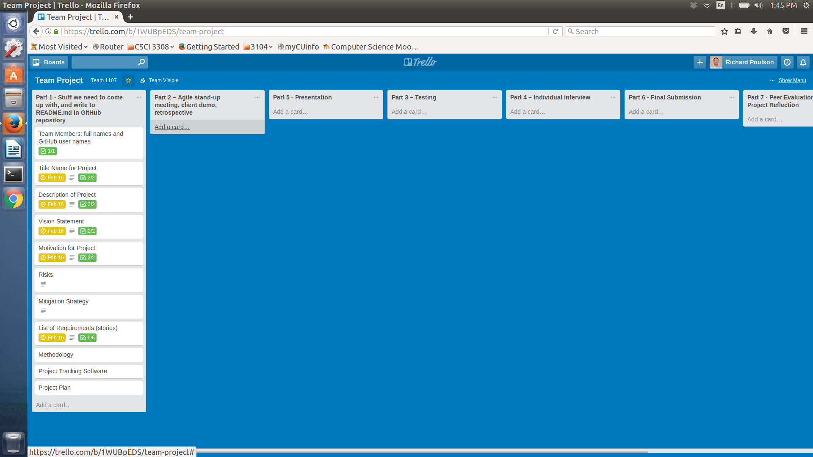

Who: Tyler Mooney, Morgan Burrows, Richard Poulson, Josh Trujillo, Patrick Baier

Project Name: Automated Twitter Manager

Vision:Create a resource for businesses to maintain a Twitter presence without having to have a dedicated social media manager.

Automated Test Cases:
	
	We will be using selenium as our automated test tool.
	It is a tool to automate the browser, we will program it to click buttons and fill out forms.

	link: http://www.seleniumhq.org/

//insert correct screenshot of selenium working here

User Acceptance Test Plans: 

	Use Case Name
		Verify Heroku live deploy
	Description
		Run the application on Heroku and make sure all pages exist
	Pre-Conditions
		User knows the Heroku address
	Test Steps
		1. Navigate to twittermanager.herokuapp.com
		2. Wait for the homepage to load
		3. Click on the various pages on the navbar to ensure they work
	Expected Result
		User should be able to see all pages
	Actual Result
		All pages load as would be expected
	Status
		Pass
	Notes
		N/a
	Post Conditions
		User has access to our webapp.

Login Authentication Test:
	
	Use Case Name

	Description

	Pre-Conditions

	Test Steps

	Expected Result

	Actual Result

	Status

	Notes

	Post Conditions

User Sign-Up Test:

	Use Case Name

	Description

	Pre-Conditions

	Test Steps

	Expected Result

	Actual Result

	Status

	Notes

	Post Conditions

