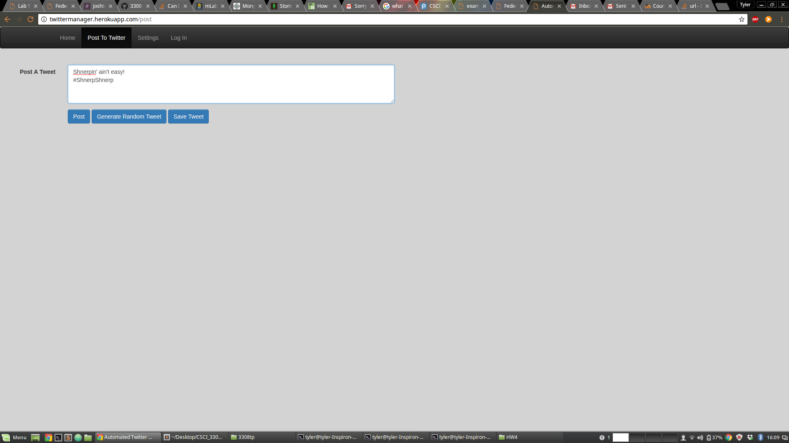

Who: Tyler Mooney, Morgan Burrows, Richard Poulson, Josh Trujillo, Patrick Baier

Project Name: Automated Twitter Manager

Vision:Create a resource for businesses to maintain a Twitter presence without having to have a dedicated social media manager.

Automated Test Cases:

User Acceptance Test Plans: 

	Use Case Name
		Verify Heroku live deploy
	Description
		Run the application on Heroku and make sure all pages exist
	Pre-Conditions
		User knows the Heroku address
	Test Steps
		1. Navigate to twittermanager.herokuapp.com
		2. Wait for the homepage to load
		3. Click on the various pages on the navbar to ensure they work
	Expected Result
		User should be able to see all pages
	Actual Result
		All pages load as would be expected
	Status
		Pass
	Notes
		N/a
	Post Conditions
		User has access to our webapp.

User Sign-Up Test:

	Use Case Name
		Verify Sign-Up and proper POSTs to DB with subsequent redirect
	Description
		Run live Sign-Up page that correctly connects to our live MongoDB and POSTs when new users sign up.
		Verify that the user is properly redirected to an individual user session with profile.
	Pre-Conditions
		User knows the web address and has a email:password in mind.
	Test Steps
		1. From homepage click 'Sign-Up' button
		2. Wait to be successfully redirected to 'Sign-Up' screen
		3. Enter a valid email and password in the appropriate fields (respectively labeled)
		4. Click Sign-Up button and wait to be properly redirected
		5. Wait for proper individual user-profile to be displayed with corresponding information
	Expected Result
		User should email:password should be successfully POSTed to DB, creating a new user model and properly redirecting
		the user to their individual session and displaying their newly created individual profile.
	Actual Result
		Sign-Up successfully POSTed, created model and redirected.
		Correctly displayed individual user profile with bcrypted password.
	Status
		Pass
	Notes
		N/a
	Post Conditions
		User is in an individual session and their user profile is properly displayed.
		
Login Authentication Test:
	
	Use Case Name
		Verify Login Authentication
	Description
		Run live login page that correctly reads from our live MongoDB and authenticates users based on email:password.
		Properly reads from bcrypted password and redirects to individual User Profile upon successful login.
		Displays errors upon not finding user in DB or incorrect password.
	Pre-Conditions
		Have a user that is already signed up with proper email:password to subsequently login.
	Test Steps
		1. Following Successful Sign-Up (set email-password)
		2. Input correct email:password
		3. Wait for successful authentication (redirect to user-profile)
		4. Input user email:password NOT in DB
		5. Wait for error message to be displayed (no redirecting)
		6. Input correct user email with INCORRECT password
		7. Wait for error message to be dispalyed (no redirecting)
	Expected Result
		Login should maintain proper authentication and correctly search DB and display corresponding errors if necessary.
	Actual Result
		Successfully authenticated and displayed correct corresponding errors for each step.
	Status
		Pass
	Notes
		N/a
	Post Conditions
		User has access to individual user profile (displayed), and is in their own user session.
		

